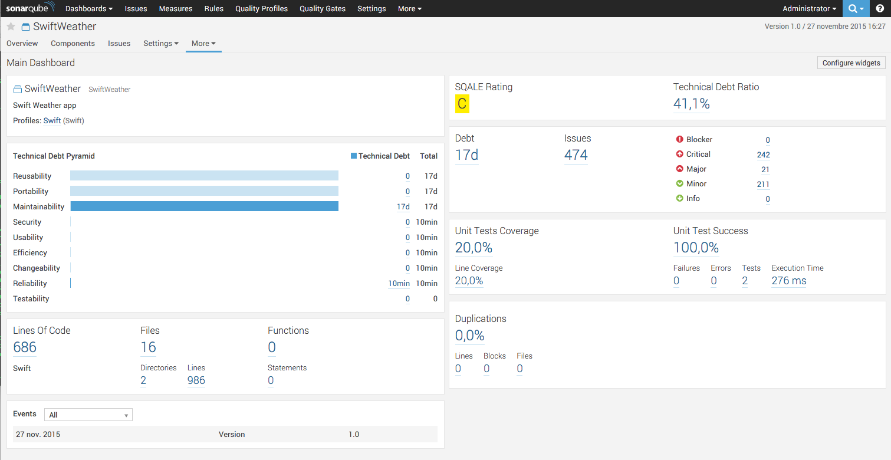
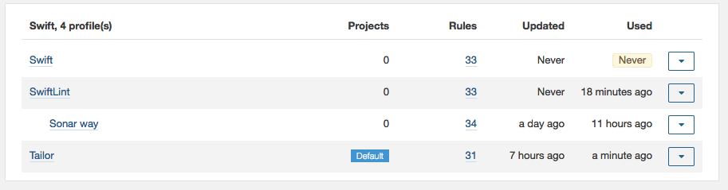

<p align="left">
  
</p>

| Branch   |      Status                                                                                                                                |
|----------|:------------------------------------------------------------------------------------------------------------------------------------------:|
| master | [](https://travis-ci.org/Backelite/sonar-swift)  |
| develop| [](https://travis-ci.org/Backelite/sonar-swift) |

SonarQube Plugin for Swift
================================

This is an open source initiative for Apple Swift language support in SonarQube.
The structure of the plugin is based on the [sonar-objective-c](https://github.com/octo-technology/sonar-objective-c) plugin.

<p align="center">
  
</p>

In SonarQube under Quality Profiles the used Linter can be specified by selecting either the SwiftLint Profile or the Tailor Profile as Default profile for Swift Projects:
<p align="center">

  
</p>

### Features

| Feature 		| Supported	| MacOS	| Unix |
|---------------|----------|:-----------:|:-----------:|
| Complexity	|YES			|Uses [Lizard](https://github.com/terryyin/lizard)| Uses [Lizard](https://github.com/terryyin/lizard)|
| Design		|NO			|			| |
| Documentation	|YES		|			| |
| Duplications	|YES		|			| |
| Issues		|YES		| Uses [SwiftLint](https://github.com/realm/SwiftLint) and/or [Tailor](https://github.com/sleekbyte/tailor)| Uses [Tailor](https://github.com/sleekbyte/tailor)|
| Size			|YES		|			||
| Tests			|YES		| Uses xcodebuild + xcpretty [xcpretty](https://github.com/supermarin/xcpretty)	| Not Supported |
| Code coverage	|YES			| Uses [slather](https://github.com/venmo/slather)			| Not Supported|


### Download

Checkout the [Releases](https://github.com/Backelite/sonar-swift/releases) page.

The full release history is also available in [CHANGELOG.md](./CHANGELOG.md).

### Launching an analysis
If you use [fastlane](https://fastlane.tools), please read [our fastlane integration doc](docs/sonarqube-fastlane.md).
Otherwise, run the ```run-sonar-swift.sh``` script from your Xcode project root folder

### Prerequisites

- a Mac with Xcode 7 or +
- [SonarQube](https://docs.sonarqube.org/display/SONAR/Setup+and+Upgrade) and [SonarQube Scanner](https://docs.sonarqube.org/display/SCAN/Analyzing+with+SonarQube+Scanner)
- [xcpretty](https://github.com/supermarin/xcpretty) (see instructions below)
- [SwiftLint](https://github.com/realm/SwiftLint) ([HomeBrew](http://brew.sh) installed and ```brew install swiftlint```). Version 0.3.0 or above.
- [Tailor](https://github.com/sleekbyte/tailor) ([HomeBrew](http://brew.sh) installed and ```brew install tailor```). Version 0.11.1 or above.
- [slather](https://github.com/SlatherOrg/slather) (```gem install slather```). Version 2.1.0 or above (2.4 since Xcode 8.3).
- [lizard](https://github.com/terryyin/lizard) ([PIP](https://pip.pypa.io/en/stable/installing/) installed and ```sudo pip install lizard```)

### Installation of xcpretty with JUnit reports fix

At the time, xcpretty needs to be fixed to work with SonarQube.

To install the fixed version, follow those steps :

	git clone https://github.com/Backelite/xcpretty.git
	cd xcpretty
	git checkout fix/duration_of_failed_tests_workaround
	gem build xcpretty.gemspec
	sudo gem install --both xcpretty-0.2.2.gem

### Installation (once for all your Swift projects)
- Download the plugin binary into the $SONARQUBE_HOME/extensions/plugins directory
- Copy [run-sonar-swift.sh](https://rawgithub.com/Backelite/sonar-swift/master/src/main/shell/run-sonar-swift.sh) somewhere in your PATH
- Restart the SonarQube server.

### Configuration (once per project)
- Copy [sonar-project.properties](https://raw.githubusercontent.com/Backelite/sonar-swift/master/sonar-project.properties) in your Xcode project root folder (along your .xcodeproj file)
- Edit the ```sonar-project.properties``` file to match your Xcode iOS/MacOS project

**The good news is that you don't have to modify your Xcode project to enable SonarQube!**. Ok, there might be one needed modification if you don't have a specific scheme for your test target, but that's all.

### Update (once per plugin update)
- Install the lastest plugin version
- Copy ```run-sonar-swift.sh``` somewhere in your PATH

If you still have *run-sonar-swift.sh* file in each of your project (not recommended), you will need to update all those files.

### Contributing

Feel free to contribute to this plugin by issuing pull requests to this repository.

When creating a pull request: always create it for the *develop* branch. 

### License

SonarQube Plugin for Swift is released under the [GNU LGPL 3 license](http://www.gnu.org/licenses/lgpl.txt).
